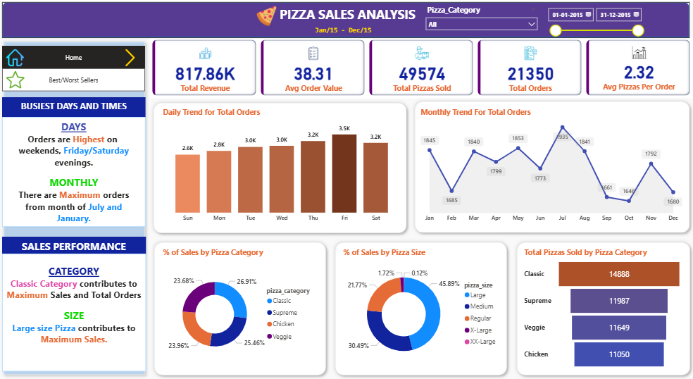
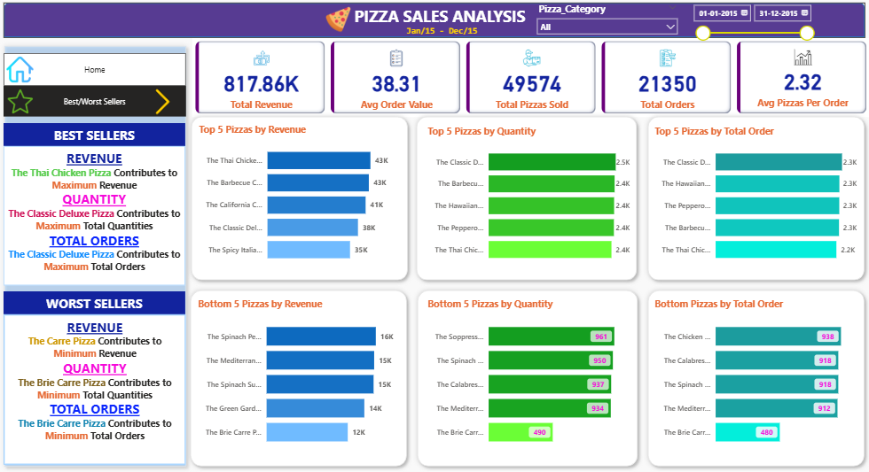

# Pizza_Sales_Analysis

Analyzing pizza sales data to identify top-selling pizzas, revenue trends, and provide actionable insights using Power BI and SQL.
## Table of Contents
- [Overview](#overview)
- [Business Problem](#business-problem)
- [Dataset Details](#dataset-details)
- [Tools & Technologies](#tools--technologies)
- [Project Structure](#project-structure)
- [Data Cleaning & Preparation](#data-cleaning--preparation)
- [Dashboard](#dashboard)
- [Key Insights](#key-insights)
- [Suggestions](#final-recommendations)
- [How to Run This Project](#how-to-run-this-project)
- [Author & Contact](#author--contact)


---

## Overview
The Pizza Sales Analysis project evaluates the performance of different pizza varieties by examining sales 
trends, revenue patterns, and customer preferences. The analysis highlights high-demand and low-demand 
pizzas, average order values, and overall sales efficiency. Key insights and recommendations aim to 
support menu optimization, marketing strategies, and revenue growth, providing actionable guidance for 
business decision-making.

## Business Problem
### 1) KPI Requirements:
1. What is the total revenue generated during the selected period? 
2. What is the average order value (AOV)? 
3. How many total pizzas were sold? 
4. How many total orders were placed? 
5. What is the average number of pizzas per order? 

### 2) Chart & Analysis Requirements: 
1. Analyze daily total orders trend across the week 
2. Examine monthly total orders trend throughout the year 
3. Calculate percentage sales contribution by pizza category 
4. Calculate percentage sales contribution by pizza size 
5. Compute total pizzas sold per category 
6. Identify top 5 pizzas by revenue 
7. Identify top 5 pizzas by quantity sold 
8. Identify top 5 pizzas by total orders 
9. Identify bottom 5 pizzas by revenue 
10. Identify bottom 5 pizzas by quantity sold 
11. Identify bottom 5 pizzas by total orders

## Dataset Details
Source of data: GitHub                                                                                                                                                       
Size of Dataset: Cleaned data(48,620 rows x 18 columns)                                                                                                                                        
Key fields/variables: quantity, order_date,
total_price, pizza_size, pizza_category, pizza_ingredients, pizza_name

## Tools & Technologies
SQL: Used SQL queries with functions like SUM, COUNT, AVG, GROUP BY, and ORDER BY to analyze pizza sales and calculate KPIs.

Power BI: Dashboards, KPI cards, Charts, Visualizations, DAX functions, Aggregations, Data Modeling, 
Insights                                                                                                                                                                                      
MS Word: Report Making

## Project Structure


```bash
Pizza_Sales_Analysis/
│
├── README.md               
├── .gitignore                                # Specifies files/folders to ignore in Git
│
├── data/                                     # Dataset
│   └── pizza_sales.csv
│
├── scripts/                                  # SQL scripts 
│   ├── KPI's_Queries.sql
│   ├── Pizza_Category_and_Size.sql
│   ├── Sale's_Trend_Analysis.sql
│   └── Top_and_Bottom_5_Pizzas.sql
│
├── dashboard/                                 # Power BI dashboard
│   └── Pizza_Sales_Dashboard.pbix
│
├── reports/                                   # Power BI & SQL reports
│   ├── Pizza_Sales_Dashboard_Report.pdf
│   └── Pizza_Sales_SQL_Report.pdf
│
└── images/                                    # Dashboard screenshots
    ├── Dashboard1.png
    └── Dashboard2.png


```

## Data Cleaning & Preparation
1. Removed unwanted columns from the dataset.
2. Created new columns and measures for analysis.
3. Corrected inconsistent date formats into local format.

## Dashboard
POWERBI Dashboard Shows:

1. KPIs Overview: Total revenue, total orders, total pizzas sold, and average order value.
2. Sales Trends: Monthly and weekly sales patterns with peak periods highlighted.
3. Product Insights: Performance of different pizza categories, sizes, and individual pizzas.
4. Top & Bottom Analysis: Best and worst 5 pizzas by revenue, quantity, and orders.
5. Interactive Filters: Options to filter by date, category, or size for deeper insights.




## Key Insights
1. Top 5 pizzas drive majority revenue – critical for business.
2. Thai Chicken & Barbecue Chicken → highest revenue (premium favorites).
3. Classic Deluxe Pizza → highest units sold.
4. Large size pizzas → ~50% of sales.
5. Classic category → most popular (1 in 4 pizzas sold).
6. Fridays & Saturdays → busiest days.
7. January & July → peak sales months.
8. September → lowest sales.

## Suggestions
1. Focus marketing on top 5 revenue pizzas.
2. Upsell Thai & Barbecue Chicken Pizzas with bundles.
3. Promote Large pizza combos/family deals.
4. Boost weekend offers (Fri & Sat).
5. Plan inventory & staffing for Jan/Jul peaks.
6. Run Sept discounts/new flavors to lift sales.
7. Review Brie Carre Pizza for revamp or removal.

## How to Run This Project

1. Clone the Repository:
```bash
git clone https://github.com/Anjaneyak24/pizza-sales-analysis-sql-powerbi.git
```
2. Click the links below to open the SQL scripts:
- [KPI's_Queries.sql](scripts/KPI's_Queries.sql)
- [Pizza_Category_and_Size.sql](scripts/Pizza_Category_and_Size.sql)
- [Sale's_Trend_Analysis.sql](scripts/Sale's_Trend_Analysis.sql)
- [Top_and_Bottom_5_Pizzas.sql](scripts/Top_and_Bottom_5_Pizzas.sql)

3. Click the link below to view the POWERBI Dashboard
 -[Pizza_Sales_Dashboard.pbix](dashboard/Pizza_Sales_Dashboard.pbix)

4. Click the links below to view the POWRBI and SQL reports:
- [Pizza_Sales_Dashboard_Report](reports/Pizza_Sales_Dashboard_Report.pdf)  
- [Pizza_Sales_SQL_Report](reports/Pizza_Sales_SQL_Report.pdf)

5. Click the link below to view Dataset
 -[pizza_sales](data/pizza_sales.csv)

## Author & Contact

**Anjaneya K**  
_Data Analyst_  
📧 Email: anjaneyak3.142@gmail.com
